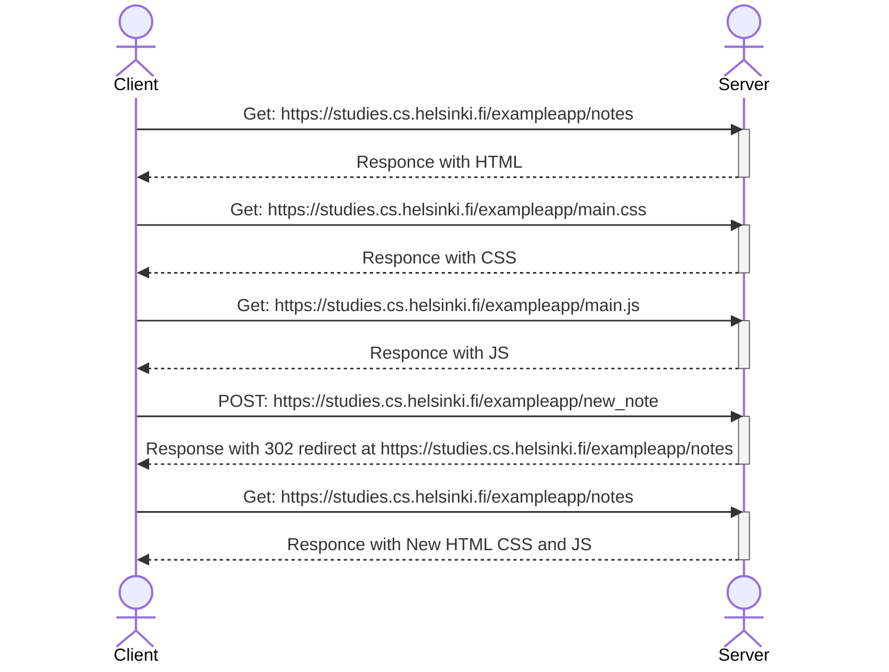

```mermaid
sequenceDiagram
        actor Client
        actor Server
        Client->>Server: Get: https://studies.cs.helsinki.fi/exampleapp/notes
        activate Server
        Server-->>Client: Responce with HTML
        deactivate Server
        Client->>Server: Get: https://studies.cs.helsinki.fi/exampleapp/main.css
        activate Server
        Server-->>Client: Responce with CSS
        deactivate Server
        Client->>Server: Get: https://studies.cs.helsinki.fi/exampleapp/main.js
        activate Server
        Server-->>Client: Responce with JS
        deactivate Server
        Client->>Server: POST: https://studies.cs.helsinki.fi/exampleapp/new_note
        activate Server
        Server-->>Client: Response with 302 redirect at https://studies.cs.helsinki.fi/exampleapp/notes
        deactivate Server
        Client->>Server: Get: https://studies.cs.helsinki.fi/exampleapp/notes
        activate Server
        Server-->>Client: Responce with New HTML CSS and JS
        deactivate Server
```