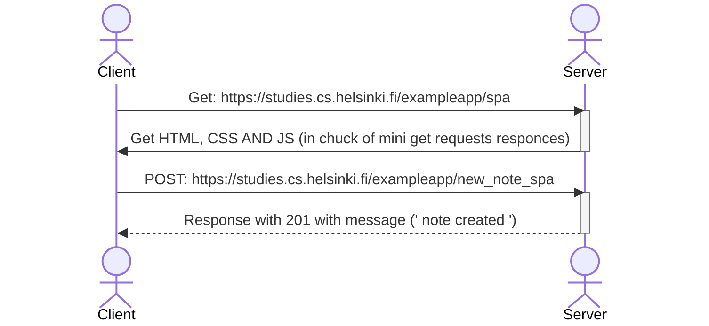

```mermaid
sequenceDiagram
        actor Client
        actor Server
        Client->>Server: Get: https://studies.cs.helsinki.fi/exampleapp/spa
        activate Server
        Server->>Client: Get HTML, CSS AND JS (in chuck of mini get requests responces)
        deactivate Server
        Client->>Server: POST: https://studies.cs.helsinki.fi/exampleapp/new_note_spa
        activate Server
        Server-->>Client: Response with 201 with message (' note created ') 
        deactivate Server
```